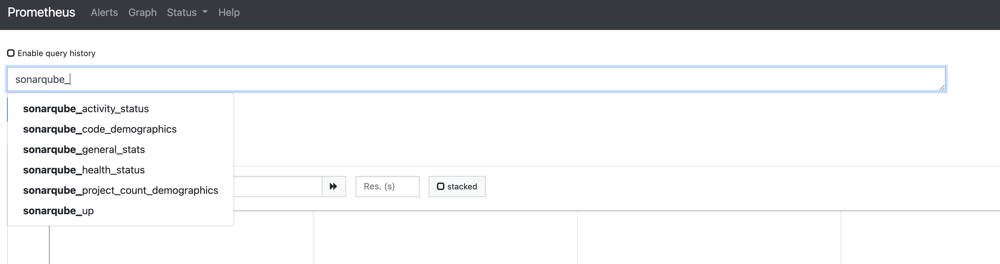

SonarQube Exporter
========================
[](https://pkg.go.dev/github.com/junkpiano/sonarqube-exporter)

SonarQube Exporter for Prometheus



## Build

```bash
export SONAR_URL=https://sonarqube.example.com/
export SONAR_USER=yourusername
export SONAR_PASSWORD=yourpassword

go build -o sonarqube-exporter cmd/main.go
./sonarqube-exporter
```

## Build with Docker

```bash
docker build -t my-sonarqube-exporter .
docker run -p 2112:2112 --env-file .env my-sonarqube-exporter 

# If you want to run it in detached mode
docker run -p 2112:2112 --env-file .env -d my-sonarqube-exporter 
```

## Author

[Yusuke Ohashi](mailto:github@junkpiano.me)
